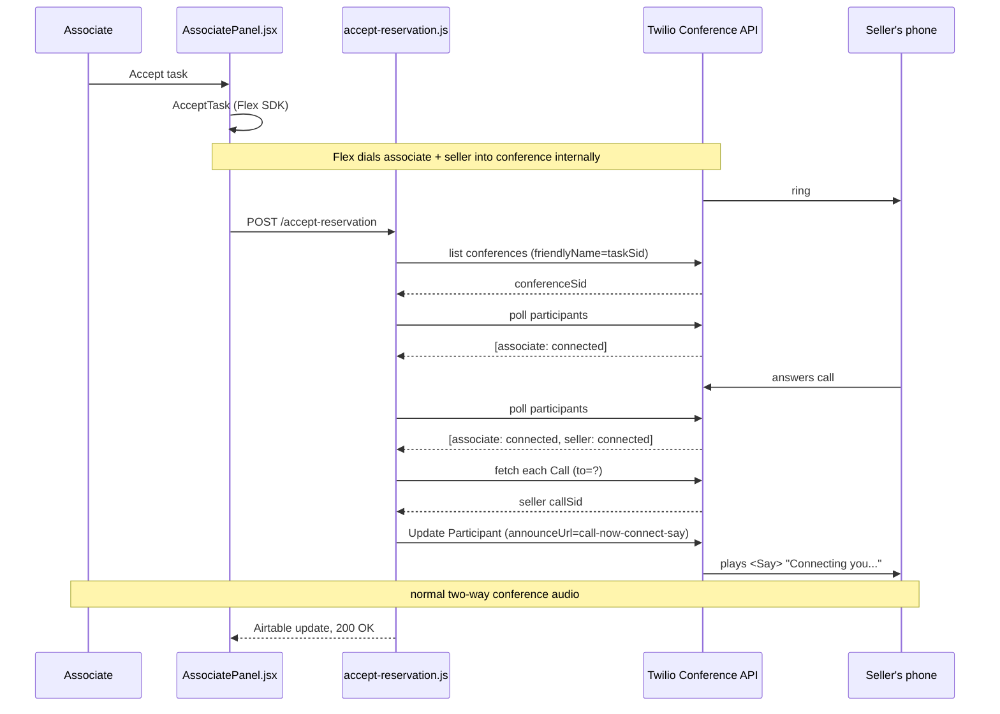

# Conference / Participant Announce (`<Say>` on seller connect)

Applies to the **callback/conference** flow (task created directy via
`create-task.js` with `attributes.isCallback: true` and `routingTarget`— the associate accepts first, then Flex
dials the seller into a conference named after the Task SID).

## Why this exists

Flex's SDK bridges the associate and seller into a conference internally — there's no TwiML
webhook exposed for the moment the seller's leg answers. To play a greeting at that moment,
the backend polls the live conference/participants and then calls Twilio's **Announce API**,
which injects TwiML into an already-live conference without disturbing the existing bridge.
Normal two-way audio resumes automatically once the announcement TwiML finishes (as long as it
doesn't `<Hangup/>`/redirect).

## Two ways to announce

| Mode | REST call | Who hears it |
|---|---|---|
| **Conference-level** | `POST /Conferences/{ConferenceSid}` | Everyone in the conference |
| **Participant-level** | `POST /Conferences/{ConferenceSid}/Participants/{CallSid}` | Only that one leg |

Both take the same `AnnounceUrl` / `AnnounceMethod` parameters, pointing at a TwiML endpoint
(eg. `call-now-connect-say.js` hosted on functions, which returns a `<Say>` or `<Play>`).

The current implementation uses **participant-level**, targeted at the seller's leg only, so
the associate doesn't hear the greeting. The conference-level call is kept commented out in
`accept-reservation.js` for easy toggling back to "both parties hear it."

## Steps (backend flow)

1. **Trigger**: Associate accepts the task in `AssociatePanel.jsx` → `AcceptTask` → frontend
   `POST /accept-reservation` with `{ task_sid, reservation_sid, channel: 'call_now', isCallback: true, ... }`.
2. **Find the conference**: `accept-reservation.js` polls
   `client.conferences.list({ friendlyName: task_sid, status: 'in-progress' })` (conference
   `friendlyName` is always the Task SID for this flow) until it exists.
3. **Wait for the seller to answer**: poll
   `client.conferences(conferenceSid).participants.list()` until there are 2 participants and
   both have `status === 'connected'` (Participant status enum: `queued | connecting | ringing |
   connected | complete | failed` — note it's `connected`, not `in-progress`).
4. **Identify the seller's leg**: fetch each participant's Call resource
   (`client.calls(p.callSid).fetch()`) and pick the one whose `to` does **not** start with
   `client:` — the associate's leg is always `client:<worker_identity>`, the seller's is a plain
   PSTN number.
5. **Announce**: call
   `client.conferences(conferenceSid).participants(sellerCall.sid).update({ announceUrl, announceMethod: 'GET' })`
   pointing at `call-now-connect-say.js`. Twilio plays that TwiML into the seller's leg only,
   then resumes normal conference audio.
6. **Best-effort**: the whole thing is wrapped in try/catch with bounded polling (~6 attempts ×
   1.5s per stage). If it times out or fails, a warning is logged but the rest of
   `accept-reservation.js` (Airtable update, HTTP response) still completes normally.

## Sequence diagram

Mermaid source below — Lucidchart can import this directly (Import > Diagram as code /
Mermaid), or paste it into any Mermaid-compatible editor to tweak it.

