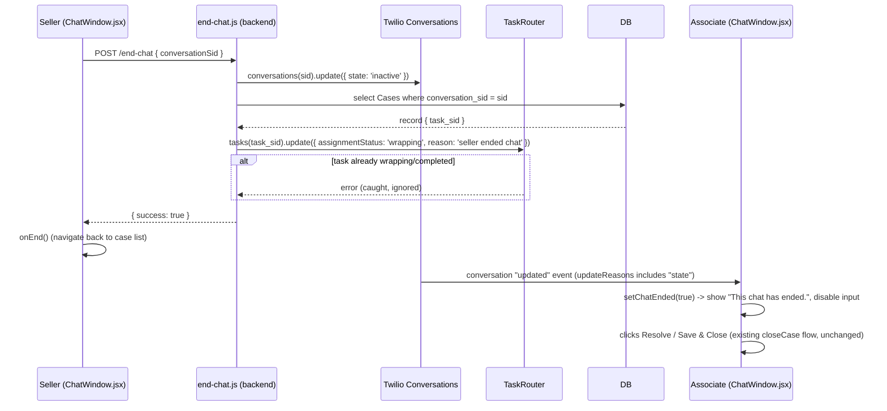
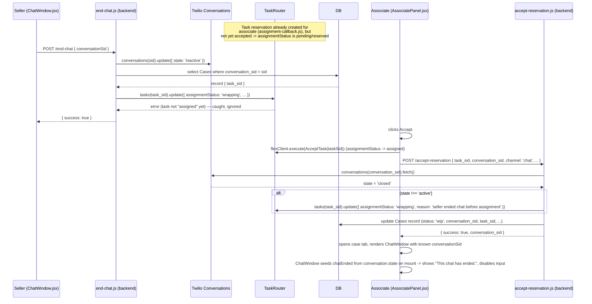

# Seller-Initiated End Chat — Technical Overview

## Scope

Covers what happens when a seller clicks **End Chat** in a live webchat case, in both timing scenarios:

- **Case A** — seller ends chat while an associate already has the task `assigned`.
- **Case B** (race condition) — seller ends chat while the task is still `pending`/`reserved`, i.e. before any associate has clicked Accept.


## Overview

The seller's chat UI renders an **End Chat** button. Clicking it POSTs to the `end-chat` Twilio Function/backend, which marks the Twilio Conversation `closed` and — if a task is already `assigned` to an associate — moves that task to `wrapping` via a direct TaskRouter REST update (the same `assigned → wrapping` transition Flex's `EndTask` action performs, just invoked server-side instead of from a live Flex client).

The gap this closes: TaskRouter reservations can exist (`assignment-callback.js` writes `task_sid`/`reservation_sid` to backend as soon as a reservation is *created* for a worker) before that worker has clicked **Accept**. If the seller ends the chat during that window, the task is not yet `assigned`, so `end-chat.js`'s `assignmentStatus: 'wrapping'` update would fail (TaskRouter only allows `assigned → wrapping`, not `pending/reserved → wrapping`) — and that failure is caught and swallowed. Without a second check, an associate could still accept into a conversation the seller already left, with no signal.

The fix: `accept-reservation.js` — which runs synchronously as part of the associate's **Accept** action, after `AcceptTask` has already put the task into `assigned` — re-checks the conversation's live `state` for chat tasks that already carry a `conversation_sid` (true for webchat, since the Studio Flow stamps it on task attributes before the task reaches any worker). If the conversation is no longer `active`, it immediately updates the task to `wrapping`, `reason: 'seller ended chat before assignment'`.

On both frontend sides, the actual "chat ended" signal is the Conversations SDK `updated` event with `updateReasons` including `"state"`. Both `ChatWindow.jsx` (seller + associate-post-accept view) and `AssociateChatPanel.jsx` (associate's pre-`conversationSid` fallback view) subscribe to it, seed a `chatEnded` flag from `conversation.state.current` on load (covers the "already ended when I opened this" case), and disable messaging with a "This chat has ended." banner.

Code sample to get conversation state change event on Associate's UI

```js
conv.conversation.on('updated', ({ updateReasons }) => {
  if (updateReasons.includes('state')) {
    setChatEnded(conv.conversation.state?.current !== 'active');
  }
});
```

## Sequence Diagram

### Case A — seller ends chat after the task is already assigned



### Case B — seller ends chat before the associate accepts (race condition)



