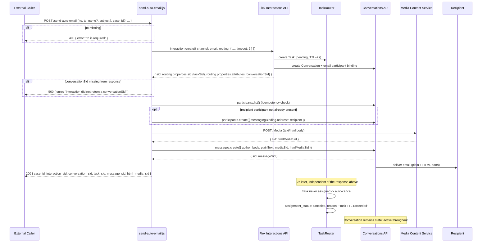

# Send Auto Email (No-Agent Confirmation) — Technical Overview

## Scope

Covers [`send-auto-email.js`](../../functions/functions/send-auto-email.js), a standalone Twilio Function that sends an automated, no-agent-needed confirmation email off a real Flex Email Interaction, while keeping the underlying Conversation alive for a later reply. Triggered by an HTTP `POST /send-auto-email` (public endpoint, no auth) from any external caller — e.g. a case-intake system, a webhook relay, or a manual test call.

## Overview

The function's core problem: Flex's Interactions API always creates a routable TaskRouter Task whenever a brand-new channel is created — `Routing` is mandatory unless you're binding to an *existing* channel via `Channel.sid`, which doesn't apply here. So there is no way to create the email Interaction/Conversation "for real" (with real workspace/workflow routing, so replies route normally later) without also creating a Task that would otherwise sit `pending` and eventually get offered to a live agent.

The fix is to make that Task a guaranteed dead end by giving it a very short `timeout` (1 seconds) in the routing properties. TaskRouter's own TTL mechanism then auto-cancels the task (`assignment_status: canceled`, `reason: "Task TTL Exceeded"`) if it isn't assigned in time — which it never is, since no agent is invited. This was deliberately chosen over calling the TaskRouter REST API directly to cancel/complete the task: Twilio's Best Practices guidance warns against managing an Interactions-owned Task via the Task API directly, and doing so was empirically confirmed (in this session) to still work, but is an unsupported pattern the `timeout` field avoids entirely.

The Interaction and Conversation are never touched by this function, so they stay `active`. A reply from the recipient later goes through Twilio's normal reply-handling path and can create a fresh, real task.

Interaction + dead-end routing (the key part):

```js
const interaction = await client.flexApi.v1.interaction.create({
  channel: {
    type: 'email',
    initiated_by: 'api',
    properties: { from: fromAddress, from_name: context.FROM_DISPLAY_NAME || 'Support', subject: emailSubject },
    participants: [{ address: recipient, level: 'to', name: to_name || recipient }],
  },
  routing: {
    properties: {
      workspace_sid: context.WORKSPACE_SID,
      workflow_sid: context.WORKFLOW_SID,
      task_channel_unique_name: 'email',
      timeout: 1, // TaskRouter auto-cancels ("Task TTL Exceeded") if unassigned in time
      attributes: { channel: 'auto_email', autoEmail: true, case_id, /* ... */ },
    },
  },
});

const taskSid = interaction.routing?.properties?.sid || '';
const conversationSid = JSON.parse(interaction.routing?.properties?.attributes || '{}').conversationSid;
```

Email content is inline (two constants at the top of the file) rather than accepted as request parameters — a deliberate simplification so the function has no external content-storage dependency:

```js
const DEFAULT_SUBJECT = 'Update on your request';
const AUTO_EMAIL_PLAIN_BODY = "Hello,\n\nThanks for reaching out. ...";
const AUTO_EMAIL_HTML_BODY = "<p>Hello,</p><p>Thanks for reaching out. ...</p>";
```

Sending the message uses the same media convention `get-case-thread.js` expects when rendering a thread — plain text on the native `body` field, rich text as a `text/html` Media attachment uploaded via the two-step MCS REST flow (not wrapped by the Node SDK):

```js
async function uploadHtmlMedia(context, html) {
  const auth = Buffer.from(`${context.ACCOUNT_SID}:${context.AUTH_TOKEN}`).toString('base64');
  const res = await fetch(`https://mcs.us1.twilio.com/v1/Services/${context.CONVERSATIONS_SERVICE_SID}/Media`, {
    method: 'POST',
    headers: { Authorization: `Basic ${auth}`, 'Content-Type': 'text/html' },
    body: html,
  });
  if (!res.ok) throw new Error(`MCS media upload failed ${res.status}: ${await res.text()}`);
  return (await res.json()).sid;
}

// later, in the handler:
const htmlMediaSid = await uploadHtmlMedia(context, AUTO_EMAIL_HTML_BODY);
const message = await conv.messages.create({
  author: fromAddress,
  attributes: JSON.stringify({ subject: emailSubject, autoEmail: true }),
  body: AUTO_EMAIL_PLAIN_BODY,
  mediaSid: htmlMediaSid,
});
```

## Sequence Diagram



## Key Components

- **`send-auto-email.js` (handler)** — validates `to`, creates the Interaction with dead-end routing, ensures the recipient participant exists, uploads the HTML body, sends the message, returns all relevant SIDs.
- **`ensureParticipant(conv, address)`** — defensive, idempotent check/create of the recipient's Conversation participant; retries up to 4 times with linear backoff, swallows and logs failure after exhausting retries.
- **`uploadHtmlMedia(context, html)`** — raw two-step MCS REST upload (no SDK wrapper exists for this endpoint), returns a Media SID for the HTML body.
- **`DEFAULT_SUBJECT` / `AUTO_EMAIL_PLAIN_BODY` / `AUTO_EMAIL_HTML_BODY`** — inline content constants; the only way to change what gets sent is to edit these and redeploy.
- **`routing.properties.timeout: 1`** — the mechanism that makes the created Task a guaranteed dead end without any explicit cancel call.

```js
const twilio = require('twilio');

// Standalone endpoint: fires an automated, no-agent-needed email off an Email
// Interaction/Conversation. The Interaction is created through the normal
// Flex Interactions routing (real workspace/workflow) — Routing is mandatory
// whenever a new channel is created, so a Task always gets created. Rather
// than canceling that Task ourselves (Twilio's Best Practices guidance
// explicitly warns against calling the Task API directly on an
// Interactions-managed task, and doing so empirically left the Interaction
// Channel in a non-terminal "setup" status), we give the Task a 2-second
// `timeout`: TaskRouter auto-cancels it ("Task TTL Exceeded") if it isn't
// assigned in time, which it never will be since no agent is invited. The
// Interaction and Conversation are never touched, so they stay active; a
// reply from the recipient later can still create a fresh task and route to
// an agent through Twilio's normal reply handling.
//
// Email content is inline for now rather than accepted as input — edit the
// constants below to change what gets sent.
const DEFAULT_SUBJECT = 'Update on your request';
const AUTO_EMAIL_PLAIN_BODY =
  "Hello,\n\nThanks for reaching out. We've received your request and wanted to confirm we're on it. If you have any additional details to share, just reply to this email.\n\n— Support Team";
const AUTO_EMAIL_HTML_BODY =
  "<p>Hello,</p><p>Thanks for reaching out. We've received your request and wanted to confirm we're on it. If you have any additional details to share, just reply to this email.</p><p>— Support Team</p>";

exports.handler = async function (context, event, callback) {
  const response = new Twilio.Response();
  response.appendHeader('Access-Control-Allow-Origin', '*');
  response.appendHeader('Access-Control-Allow-Methods', 'POST, OPTIONS');
  response.appendHeader('Access-Control-Allow-Headers', 'Content-Type');
  response.appendHeader('Content-Type', 'application/json');

  if (event.httpMethod === 'OPTIONS') {
    response.setStatusCode(200);
    return callback(null, response);
  }

  const { to, to_name, subject, help_category, case_summary } = event;

  if (!to) {
    response.setStatusCode(400);
    response.setBody({ error: 'to is required' });
    return callback(null, response);
  }

  const recipient = String(to).toLowerCase().trim();
  const case_id = event.case_id || `CASE-${Date.now()}`;
  const emailSubject = subject || DEFAULT_SUBJECT;
  const fromAddress = context.EMAIL_HYBRID_ADDRESS || context.EMAIL_ADDRESS;
  const client = twilio(context.ACCOUNT_SID, context.AUTH_TOKEN);
  const SVC = context.CONVERSATIONS_SERVICE_SID;

  try {
    // 1. Create the Email Interaction (real routing — this is what makes
    // completing the task below a genuine dead end rather than a fake one).
    const interaction = await client.flexApi.v1.interaction.create({
      channel: {
        type: 'email',
        initiated_by: 'api',
        properties: {
          from: fromAddress,
          from_name: context.FROM_DISPLAY_NAME || 'Support',
          subject: emailSubject,
        },
        participants: [{ address: recipient, level: 'to', name: to_name || recipient }],
      },
      routing: {
        properties: {
          workspace_sid: context.WORKSPACE_SID,
          workflow_sid: context.WORKFLOW_SID,
          task_channel_unique_name: 'email',
          timeout: 2,
          attributes: {
            channel: 'auto_email',
            autoEmail: true,
            case_id,
            skill: help_category || '',
            seller_name: to_name || '',
            seller_email: recipient,
            case_summary: case_summary || '',
          },
        },
      },
    });

    const taskSid = interaction.routing?.properties?.sid || '';
    let taskAttrs = {};
    try { taskAttrs = JSON.parse(interaction.routing?.properties?.attributes || '{}'); } catch (_) {}
    const conversationSid = taskAttrs.conversationSid || '';

    if (!conversationSid) {
      throw new Error('interaction did not return a conversationSid');
    }

    const conv = client.conversations.v1.services(SVC).conversations(conversationSid);

    // 2. Add participant if required. channel.participants above should
    // already have created it — this is a defensive, idempotent check.
    await ensureParticipant(conv, recipient);

    // 3. Send the auto email: native body carries plain text, a Media
    // attachment (content_type text/html) carries the rich body — this is
    // the same media shape get-case-thread.js already expects when it looks
    // for content-type text/html on a message's media.
    const htmlMediaSid = await uploadHtmlMedia(context, AUTO_EMAIL_HTML_BODY);

    const message = await conv.messages.create({
      author: fromAddress,
      attributes: JSON.stringify({ subject: emailSubject, autoEmail: true }),
      body: AUTO_EMAIL_PLAIN_BODY,
      mediaSid: htmlMediaSid,
    });

    response.setBody({
      case_id,
      interaction_sid: interaction.sid,
      conversation_sid: conversationSid,
      task_sid: taskSid,
      message_sid: message.sid,
      html_media_sid: htmlMediaSid,
    });
    return callback(null, response);

  } catch (err) {
    console.error('[send-auto-email]', err);
    response.setStatusCode(500);
    response.setBody({ error: err.message });
    return callback(null, response);
  }
};

async function ensureParticipant(conv, address) {
  for (let i = 0; i < 4; i++) {
    try {
      const participants = await conv.participants.list({ limit: 100 });
      const exists = participants.some(
        (p) => (p.messagingBinding?.address || '').toLowerCase() === address
      );
      if (!exists) {
        await conv.participants.create({ 'messagingBinding.address': address });
      }
      return;
    } catch (err) {
      if (i === 3) {
        console.warn('[send-auto-email] ensureParticipant failed after retries', err.message);
        return;
      }
      await new Promise((r) => setTimeout(r, 300 * (i + 1)));
    }
  }
}

async function uploadHtmlMedia(context, html) {
  const auth = Buffer.from(`${context.ACCOUNT_SID}:${context.AUTH_TOKEN}`).toString('base64');
  const res = await fetch(
    `https://mcs.us1.twilio.com/v1/Services/${context.CONVERSATIONS_SERVICE_SID}/Media`,
    {
      method: 'POST',
      headers: { Authorization: `Basic ${auth}`, 'Content-Type': 'text/html' },
      body: html,
    }
  );
  if (!res.ok) {
    const errText = await res.text();
    throw new Error(`MCS media upload failed ${res.status}: ${errText}`);
  }
  const data = await res.json();
  return data.sid;
}


