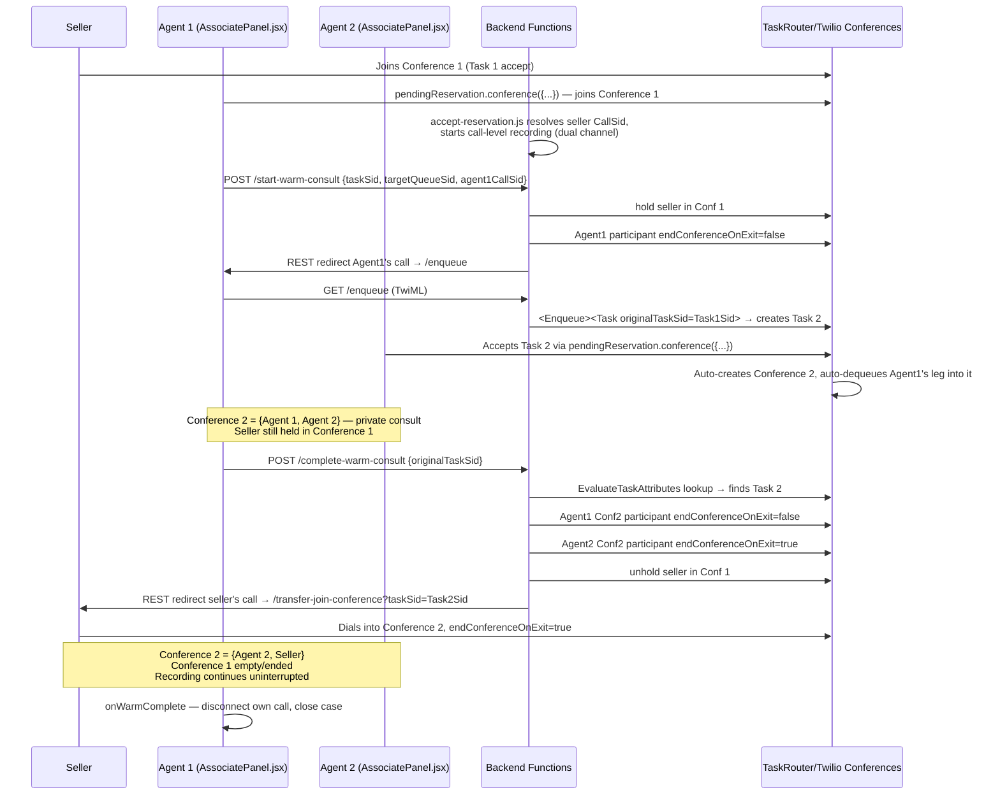

# Warm Transfer (Voice) — Technical Overview

## Scope

Covers the current, live, sequential two-conference warm-transfer implementation for `call_now`/`isCallback` voice tasks: `functions/functions/start-warm-consult.js`, `enqueue.js`, `complete-warm-consult.js`, `transfer-join-conference.js`, the seller-recording logic in `accept-reservation.js`, and the frontend wiring in `TransferMenu.jsx` (`handleWarm`/`handleCompleteTransfer`) and `AssociatePanel.jsx` (the plain `call_now` accept branch and `onWarmComplete`). It does not cover cold transfer (`transfer-cold.js`/`transfer-enqueue.js`) except where the two share code, and does not cover the disabled/dead `isWarmConsult` 3-way accept branch still present in `AssociatePanel.jsx` (kept only so `transfer-join-conference.js`'s legacy caller isn't an orphaned reference).

## Overview

The seller and Agent 1 talk in **Conference 1**, a Flex-auto-created conference named after Task 1's own SID (created when Agent 1 accepts via `pendingReservation.conference({...})`). The moment Agent 1 accepts, `accept-reservation.js` polls for the seller's leg and starts a **call-level recording** on the seller's own CallSid (`client.calls(sellerCall.sid).recordings.create(...)`) — call-level, not conference-level, so the same recording keeps running across any later TwiML redirect of that CallSid.

When Agent 1 wants to warm-transfer, `TransferMenu.jsx`'s `handleWarm` resolves Agent 1's own CallSid via the Flex SDK and POSTs to `start-warm-consult.js`, which:
1. Holds the seller in Conference 1.
2. Flips Agent 1's own Conference 1 participant to `endConferenceOnExit:false` (worker legs default to `true`; without this, redirecting Agent 1 away would end Conference 1 and drop the seller).
3. REST-redirects Agent 1's own live call leg to `/enqueue`.

`enqueue.js` parks that redirected leg via `<Enqueue><Task>`, creating **Task 2** with Agent 1's real live call already attached and `originalTaskSid` stamped on its attributes (deliberately *not* `isWarmConsult`, so whichever associate accepts it goes through the plain `call_now` accept path in `AssociatePanel.jsx`, not the disabled 3-way branch).

Agent 2 accepts Task 2 normally. TaskRouter auto-creates **Conference 2** (named after Task 2's SID) and auto-dequeues Agent 1's parked leg into it — so Conference 2 now holds {Agent 1, Agent 2} for a private consult, with the seller still on hold in Conference 1. Agent 1 never has visibility into or control over Conference 2 beyond this initial creation.

When Agent 1 clicks "Complete transfer," `TransferMenu.jsx` POSTs `{ originalTaskSid }` to `complete-warm-consult.js`, which:
1. Finds Task 2 via `EvaluateTaskAttributes: originalTaskSid == '...'` (Agent 1 never accepted Task 2, so this is its only handle on it).
2. Flips Agent 1's Conference 2 participant to `endConferenceOnExit:false` and Agent 2's own Conference 2 participant to `endConferenceOnExit:true` (see Gotchas).
3. Re-fetches Task 1, unholds the seller in Conference 1, and REST-redirects the seller's call to `/transfer-join-conference?taskSid=<Task2Sid>`.

`transfer-join-conference.js` dials the seller into Conference 2 with `endConferenceOnExit:true`. Conference 2 is now {Agent 2, Seller}; Conference 1 is empty and ends. The seller's original call-level recording keeps running uninterrupted through this hop. Agent 1's own call disconnects (`onWarmComplete` in `AssociatePanel.jsx`) and Task 1 completes.

Three parties are never in the same conference at once — this is a deliberate simplification over a genuine 3-way, driven by Twilio's 2-channel conference-recording cap and general 3-way audio complexity.

## Sequence Diagram



## Key Components

- **`accept-reservation.js`** — on Task 1's original accept, polls the Flex-auto conference for the seller's leg (`resolveSellerCallOnConnect`) and starts a call-level dual-channel recording on the seller's own CallSid (`startSellerRecordingOnConnect`); for `isCallback` tasks also whispers a connect announcement to the seller (`announceOnSellerConnect`). Both helpers now share a single resolved `{conferenceSid, sellerCall}` per branch.

  ```js
  // Starts ONE call-level recording on the seller's own CallSid the moment
  // their leg first connects into Conference 1. Persists across any later
  // TwiML redirect for that CallSid, so it keeps going when a warm transfer
  // later moves the seller's leg into Conference 2.
  async function startSellerRecordingOnConnect(client, resolved) {
    if (!resolved) return;
    await client.calls(resolved.sellerCall.sid).recordings.create({ recordingChannels: 'dual' });
  }

  // call site — isCallback branch, resolved once, shared by announce + recording
  const resolved = await resolveSellerCallOnConnect(client, task_sid);
  await Promise.all([
    announceOnSellerConnect(client, context, resolved),
    startSellerRecordingOnConnect(client, resolved),
  ]);
  ```

- **`start-warm-consult.js`** — holds the seller, flips Agent 1's Conference 1 leg to survive Agent 1 leaving, then REST-redirects Agent 1's own call into `/enqueue`.

  ```js
  const attrs = JSON.parse(task.attributes || '{}');
  const conferenceSid = attrs.conference?.sid;
  const sellerCallSid = attrs.conference?.participants?.customer || attrs.call_sid;

  await client.conferences(conferenceSid).participants(sellerCallSid).update({ hold: true });
  await client.conferences(conferenceSid).participants(agent1CallSid).update({ endConferenceOnExit: false });

  const enqueueUrl =
    `https://${context.DOMAIN_NAME}/enqueue` +
    `?originalTaskSid=${encodeURIComponent(taskSid)}` +
    `&targetQueueSid=${encodeURIComponent(targetQueueSid)}`;

  await client.calls(agent1CallSid).update({ url: enqueueUrl, method: 'GET' });
  ```

- **`enqueue.js`** — TwiML endpoint that parks Agent 1's redirected leg via `<Enqueue><Task>`, creating Task 2 with `originalTaskSid` and no `isWarmConsult` flag.

  ```js
  const originalAttrs = JSON.parse(task.attributes || '{}');
  delete originalAttrs.reservation_attributes;
  delete originalAttrs.isCallback;
  delete originalAttrs.outbound_to;
  delete originalAttrs.direction;
  delete originalAttrs.originating_case;
  delete originalAttrs.conference;

  const attributes = {
    ...originalAttrs,
    transferTargetQueueSid: targetQueueSid,
    originalTaskSid,
    name: `Warm Transfer: ${originalAttrs.seller_name || ''}`,
  };

  const workflowSid = context.TRANSFER_WORKFLOW_SID || context.WORKFLOW_SID;
  const enqueue = twiml.enqueue({ workflowSid });
  enqueue.task({}, JSON.stringify(attributes));
  ```

- **`complete-warm-consult.js`** — finds Task 2 via `EvaluateTaskAttributes`, flips both Conference 2 participants' `endConferenceOnExit` explicitly (Agent 1 → false, Agent 2 → true), unholds the seller, and redirects the seller's call into Conference 2.

  ```js
  const consultTasks = await client.taskrouter.v1
    .workspaces(context.WORKSPACE_SID)
    .tasks.list({
      workflowSid,
      evaluateTaskAttributes: `originalTaskSid == '${originalTaskSid}'`,
      limit: 1,
    });

  const task2 = consultTasks[0];
  const task2Attrs = JSON.parse(task2.attributes || '{}');
  const conference2Sid = task2Attrs.conference?.sid;
  const agent1CallSid = task2Attrs.conference?.participants?.customer;
  const agent2CallSid = task2Attrs.conference?.participants?.worker;

  await client.conferences(conference2Sid).participants(agent1CallSid).update({ endConferenceOnExit: false });

  // Made explicit rather than trusting TaskRouter's own worker-leg default —
  // see Gotchas.
  if (agent2CallSid) {
    await client.conferences(conference2Sid).participants(agent2CallSid).update({ endConferenceOnExit: true });
  }

  // ... unhold seller in Conference 1, then:
  const joinUrl = `https://${context.DOMAIN_NAME}/transfer-join-conference?taskSid=${encodeURIComponent(task2.sid)}`;
  await client.calls(sellerCallSid).update({ url: joinUrl, method: 'GET' });
  ```

- **`transfer-join-conference.js`** — TwiML endpoint that dials whatever call hits it into the conference named by `event.taskSid`, with `endConferenceOnExit:true`; reused by `complete-warm-consult.js` to move the seller into Conference 2.

  ```js
  exports.handler = function (context, event, callback) {
    const twiml = new Twilio.twiml.VoiceResponse();
    const dial = twiml.dial();
    dial.conference({ endConferenceOnExit: true }, event.taskSid);

    const response = new Twilio.Response();
    response.appendHeader('Content-Type', 'text/xml');
    response.setBody(twiml.toString());
    return callback(null, response);
  };
  ```

- **`TransferMenu.jsx`** — `handleWarm` resolves Agent 1's own CallSid via `GetTaskParticipants` and calls `/start-warm-consult`; `handleCompleteTransfer` calls `/complete-warm-consult` then fires `onWarmComplete`.

  ```js
  const handleWarm = async (queue) => {
    const participants = await flexClient.execute(new GetTaskParticipants(taskSid));
    const self = participants.find((p) => p.type === 'agent');
    const agent1CallSid = self?.mediaProperties?.callSid;
    if (!agent1CallSid) throw new Error('Could not resolve own call leg for warm transfer');

    const res = await fetch(`${baseUrl}/start-warm-consult`, {
      method: 'POST',
      headers: { 'Content-Type': 'application/json' },
      body: JSON.stringify({ taskSid, targetQueueSid: queue.queueSid, agent1CallSid }),
    });
    // ... setStatus('warm-active')
  };

  const handleCompleteTransfer = async () => {
    const res = await fetch(`${baseUrl}/complete-warm-consult`, {
      method: 'POST',
      headers: { 'Content-Type': 'application/json' },
      body: JSON.stringify({ originalTaskSid: taskSid }),
    });
    const data = await res.json();
    if (!res.ok || !data.success) throw new Error(data.error || 'Complete transfer failed');
    onWarmComplete?.();
  };
  ```

- **`AssociatePanel.jsx`** — plain `call_now` accept branch (unchanged, agnostic to warm-transfer topology) is what both Agent 1's original accept and Agent 2's Task-2 accept go through; `onWarmComplete` disconnects Agent 1's own call and closes the case once `/complete-warm-consult` has already flipped the relevant flags.

  ```js
  // plain call_now accept — used by both Agent 1 (Task 1) and Agent 2 (Task 2)
  await pendingReservation.conference({
    to: `client:${workerIdentity}`,
    from: import.meta.env.VITE_TWILIO_PHONE_NUMBER,
  });
  ```

  ```js
  onWarmComplete={async () => {
    // complete-warm-consult.js already flipped Agent 1's Conference 2
    // participant to endConferenceOnExit:false — safe to disconnect here.
    try { await voiceCall.call?.disconnect(); } catch (e) { console.warn(e); }
    onClose(false, { viaWarmTransferComplete: true });
  }}
  ```

## Gotchas & Risks

- **Ambiguous TaskRouter worker-leg default, made explicit.** `leave-conference.js`'s own comment claims a worker leg defaults to `endConferenceOnExit:true`, but live testing showed that relying on this default for Agent 2's Conference 2 participant did not reliably tear the conference down for the seller when Agent 2 hung up first. `complete-warm-consult.js:70-76` now explicitly REST-flips Agent 2's participant to `true` rather than trusting the default — the exact root cause of why the default didn't hold wasn't fully confirmed from docs alone.
- **`transfer-join-conference.js`'s `endConferenceOnExit` is shared by two call sites with opposite needs.** It's hardcoded `true` (`transfer-join-conference.js:13`), which is correct for its current sole live caller (the seller joining Conference 2 as a plain 2-party call) but would be wrong for the disabled `isWarmConsult` 3-way branch in `AssociatePanel.jsx:267` if that branch were ever re-enabled — Agent 2 leaving a real 3-way consult shouldn't kill the call for the seller and Agent 1. Re-enabling that branch would require re-introducing a parameter instead of the current hardcoded value.
- **`EvaluateTaskAttributes` string-match lookup has no uniqueness guarantee beyond `limit: 1`.** `complete-warm-consult.js:36-42` takes the first task matching `originalTaskSid == '...'` — if a given Task 1 were ever warm-transferred twice in sequence (e.g., Agent 2 also transfers onward) without Task 2 attributes changing, this could resolve the wrong consult task. Current flow only creates one Task 2 per Task 1 in practice, so this hasn't been hit, but nothing in the code enforces it.
- **Seller-CallSid resolution is a best-effort poll, not a guarantee.** `resolveSellerCallOnConnect` in `accept-reservation.js:12-55` gives up after 6 attempts / 9 seconds if the seller's leg never reaches `connected`; if that happens, no recording is ever started for that call and the failure is only logged (`console.warn`), not surfaced to the associate UI.
- **REST-redirecting Agent 1's own WebRTC/Flex-SDK leg** (`start-warm-consult.js:61`, `client.calls(agent1CallSid).update({url, method})`) is reasoned safe by analogy to `transfer-cold.js`'s existing PSTN-leg redirect pattern, but exercises the REST-redirect mechanism against a browser-originated WebRTC call rather than a plain PSTN leg — flagged during design as needing empirical confirmation, and now confirmed working via live testing, but no automated test covers this path.

## Open Questions

- Whether Twilio's `EvaluateTaskAttributes` filter supports operators beyond simple string `==` equality (e.g. for a future need to match multiple candidate consult tasks) hasn't been explored beyond the one operator this code uses.
- Whether re-enabling the disabled `isWarmConsult` 3-way branch in `AssociatePanel.jsx` is still a live future requirement, or whether it can be deleted outright along with its now-single-purpose caller in `transfer-join-conference.js`, is a product decision not resolved in code.
